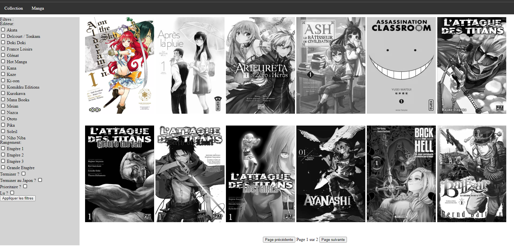
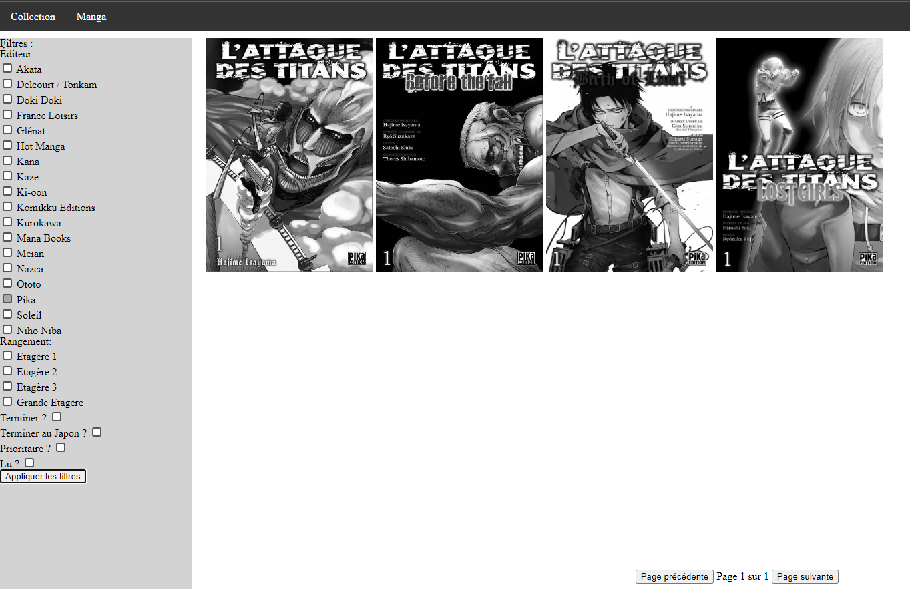
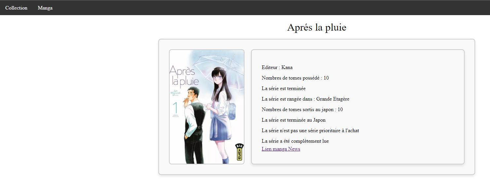

# Projet "Collection"

## Description :

Le projet "Collection" est conçu pour transformer un fichier Google Sheets en une présentation visuelle de ma collection de mangas et d'animes. Il est destiné principalement à la lecture, sans fonctionnalités de création, mise à jour ou suppression (CRUD).

## Fonctionnalités :

- Affichage visuel de la collection de mangas et d'animes.
- Filtrage des éléments en fonction de différents critères (éditeur, rangement, état de lecture, etc.).
- Pagination pour une navigation facile entre les pages de résultats.

## Comment utiliser :

1. **Visualisation de la collection :** Une fois importée, la collection sera affichée sous forme de cartes, avec la possibilité de filtrer les éléments en fonction de différents critères.

2. **Filtrage des éléments :** Utilisez les filtres disponibles pour affiner la sélection des mangas et des animes en fonction de vos préférences.

3. **Pagination :** Si le nombre d'éléments filtrés dépasse la capacité d'une seule page, la pagination vous permet de naviguer entre les différentes pages de résultats.

## Exemples :

{width=200px}
{width=200px}
{width=200px}

## Dépendances :

- HTML
- SCSS
- Javascript
- Json

## Contributeur :

[Alexandre Vandewiele](https://github.com/AlexandreTheDwarf)